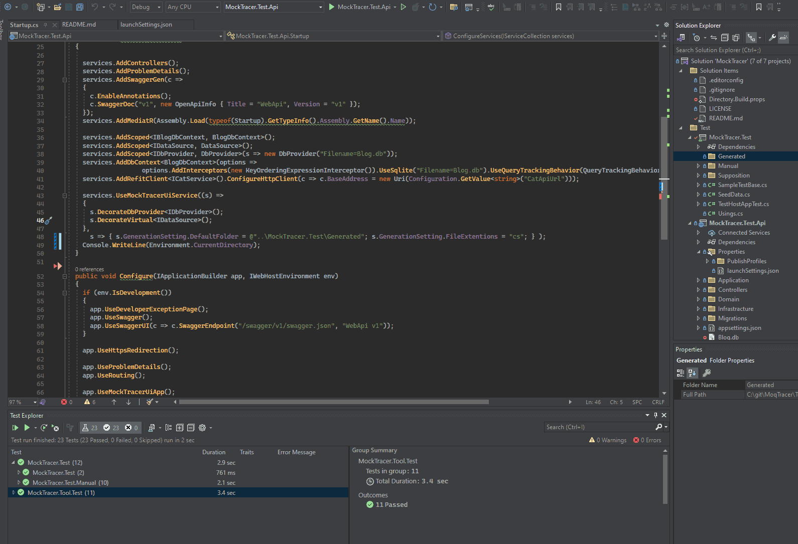

# MockTracer
 Инструмент позволяет ускорить написание юнит тестов, на основании ранее вызванных запросов (методов) в ходе которых инструментом был записан порядок вызова исполняемого кода с его аргументами и результатом обработки.

## Возможности
 - Пользовательский интерфейс со списком Стека выполнения
 - Интерфейс выбора точки входа в тест и классов результаты вызова/выполенения которых будут заменены Mock объектами
 - Tracer для отслеживания данных проходящих через `System.Net.Http.DelegatingHandler`, регистрируется автоматически
 - Tracer для отслеживания данных проходящих через `MediatR.IPipelineBehavior`, регистрируется автоматически
 - Tracer для отслеживания данных проходящих через `Microsoft.AspNetCore.Mvc.Filters.IAsyncActionFilter`, регистрируется автоматически
 - Tracer для отслеживания данных проходящих произвольный интерфейс, регистрируется `services.UseMockTracerUiService((s) => s.DecorateVirtual<ISomeInterface>())`
 - Tracer для отслеживания данных проходящих через `System.Data.IDbConnection`, регистрируется `services.UseMockTracerUiService((s) => s.DecorateDbProvider<ISomeConnectionProvider>())`
 - Формирование тестого класса с методом в формате "AAA" UnitTest




## Регистрация инструмента

Переменная окружения  `"MOCKTRACER_ENABLE": "true"`

В секции services
```C#
public void ConfigureServices(IServiceCollection services)
  {
    // services...

    // регистрация декораторов MockTracer и настроек генерацйии тестов, после регистрации основного кода!
    services.UseMockTracerUiService((s) =>
    {
        // регистрация провайдера прослуживающего IDBConection
        s.DecorateDbProvider<IDbProvider>();
        // регистрация произвольного интерфейса
        s.DecorateVirtual<IDataSource>();
    },
        // переопределение настроек генерации
        s => { s.GenerationSetting.DefaultFolder = @"..\MockTracer.Test\Generated"; });

  }
```

В секции app

```C#
  public void Configure(IApplicationBuilder app, IWebHostEnvironment env)
  {
    // app...
    app.UseRouting();

    // Рагистрация интерфейса MockTracer после регистрации UseRouting()
    app.UseMockTracerUiApp();
    /// app...
  }
```

## Базовый тестовый класс

Сформированный тестовый класс основан на тестовом классе `MockTracer.TestBase`
Что бы успешно запустить сгенерированный тест предлагается два решения:
 - Nuget `MockTracer.Test` в проект с тестами
 - Скопировать исходный код базового класса и методы расширения из [репозитория](https://github.com/unby/MoqTracer/tree/master/src/MockTracer/Test) в проект с Unittest

## Ограничения 

 - После регистрации MockTracer снижается производительность, инструмент необходимо использовать локально в среде разработчика
 - Не для всех видов классов возможно реализовать операцию сериализации, для таких фрагментов кода (DTO классов) не возможно сгенерировать тестовый класс в полном объеме.
 - Запись Mock доступна для классов зарегистрированных как `ServiceLifetime.Scoped`